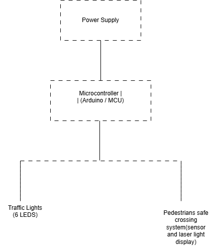

# Traffic Light Controller (FSM-Based)

## Overview

This project implements a microcontroller-based traffic light controller using a Finite State Machine (FSM).

The system controls traffic signals for two directions (North-South and East-West) using timed state transitions to ensure safe and deterministic traffic flow.

This project is part of a structured embedded systems learning roadmap covering firmware design, system architecture, hardware design, and PCB development.

---

## Features

- Finite State Machine (FSM) based control
- Non-blocking timing using `millis()`
- Deterministic traffic signal sequencing
- Expandable architecture
- Hardware prototype using Arduino

---

## System Architecture

---

## FSM States

- NS_GREEN
- NS_YELLOW
- ALL_RED_1
- EW_GREEN
- EW_YELLOW
- ALL_RED_2

State transitions ensure safe operation and prevent conflicting green lights.

---

## Hardware

- Arduino Uno / ATmega328P
- 6 LEDs
- 6 × 220Ω resistors
- Breadboard
- Jumper wires

---

## Firmware

The firmware implements a Finite State Machine that transitions between traffic states based on timing conditions.

Future improvements include:

- Pedestrian button support
- Sensor-based adaptive traffic control
- Standalone microcontroller PCB
- EEPROM configurable timing

---

## Repository Structure

- docs/ → project documentation
- firmware/ → source code
- hardware/ → schematic and PCB
- simulation/ → simulation files
- project_management/ → roadmap and logs

---

## Learning Objectives

- Embedded system architecture
- Finite State Machine design
- Non-blocking timing
- Hardware interfacing
- PCB design workflow
- Version control with Git

---

## Author

MacFish Ola